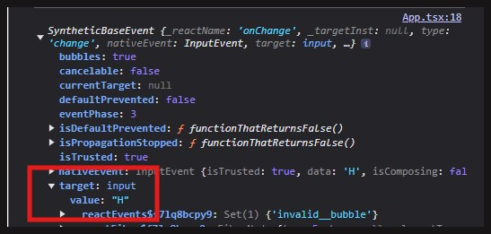
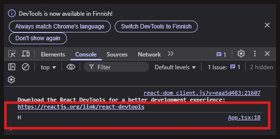

# React-sovelluksen oletusnäkymä - App-komponentti

### [<- Takaisin](../README.md)

[App.tsx](../src/App.tsx) on ensimmäinen React-komponentti, jota ohjelmoimme demoissa. Reactin komponentit toteutetaan nykyään funktionaalisina komponentteina, eli ne ovat teknisesti vain funktiota, joissa suoritetaan komentoja ja tehdään palautuksena (return) varsinainen HTML-muotoinen sisältö, joka näytetään [sisääntulopisteessä](../index.html).

Käydään alla komponentin toiminnallisuus ja koodit tarkemmin läpi

## 1. Moduulien importaus

```ts
import React, { useState } from 'react';
import './App.css';
```

Tuodaan komponentin tarvitsemat moduulit. Tässä demossa on toteutettu tilamuuttujia hyödyntävä "Hello World"-sovellus, joten tuodaan Reactin "core"-ominaisuuksista [`useState`-hook](https://react.dev/reference/react/useState "https://react.dev/reference/react/useState") tilamuuttujien käsittelyä varten. Tuodaan myös App-komponentin muotoiluun käytettävät tyylit omasta [tyylitiedostostaan](../src/App.css).

**Huomioi**, että Reactin ominaisuudet tuodaan `node_modules`-kansiosta, jolloin niihin viitataan tämän kansion alla olevan React-kansion nimellä, joka on samalla moduulin nimi. Esimerkiksi Reactin ominaisuudet tuodaan nimellä 'react', koska tämä on kansion nimi `node_modules`:n alla.

Toisaalta App.css -tiedosto ei ole Node-riippuvuutena asennettu moduuli, vaan osa React-sovelluksen omia [lähdekoodeja](../src/), jolloin se tuodaan suhteellisen polun viittauksella `./App.css`. Piste `.` viittaa suorittavan tiedoston sijaintiin (suorittava tiedosto on tämä App.tsx-komponentti, joka on src-kansiossa). Koska App.css-tyylitiedosto on samassa kansiossa, viitataan kauttaviivan `/` jälkeen suoraan tiedoston nimeen.

## 2. App-komponentin määrittäminen

```ts
const App : React.FC = () : React.ReactElement => {...}

export default App;
```

Seuraavaksi määritetään itse App-komponentti funktiona, jonka lohkoon tulee varsinainen komponentin toiminnallisuus ja sisältö. Demossa oleva funktion määrittely ei ole sama, jonka Vite tekee oletuksena, vaan nyt App on määritelty nuolifunktiona helpomman TypeScript-tyypityksen takia ja sekä funktio, että sen palautus on tyypitetty.

React-komponentit ovat funktiokomponentteja, eli niiden TypeScript-tyyppi on [`React.FC`](https://www.totaltypescript.com/you-can-stop-hating-react-fc "https://www.totaltypescript.com/you-can-stop-hating-react-fc"). React-komponenttien palautus on JSX-muotoinen [`React.ReactElement`](https://www.geeksforgeeks.org/jsxelement-vs-reactelement-vs-reactnode/ "https://www.geeksforgeeks.org/jsxelement-vs-reactelement-vs-reactnode/").

App pitää vielä määrittää vietäväksi arvoksi `export default App;`-komennolla, koska App [halutaan tuoda muualla osaksi koodia](../src/main.tsx).

## 3. Tilamuuttujien määrittäminen

[Tilamuuttujat](https://react.dev/learn/state-a-components-memory "https://react.dev/learn/state-a-components-memory") seuraavat React-komponentin tilaa ja toimivat muistina komponentin renderöintien välillä. Menemättä sen tarkempaa teknisyyksiin tiivistetään asia lyhyesti:

- Aina kun React-komponentin sisältö tai tieto muuttuu, komponentille suoritetaan uudelleenrenderöinti (päivitys, refresh jne.)
- Uudelleenrenderöinnissä komponentin koodi suoritetaan uusiksi, jolloin perinteiset muuttujat ja tiedot alustettaisiin jokaisen muutoksen jälkeen taas alkuperäisinä määritettyihin arvoihin
- Tilamuuttujat tallentavat komponentille oleellisia tietoja renderöintien "ulkopuolella", jolloin komponentti voi toimia normaalisti päivityksineen, mutta tallennetut muutokset pysyvät re-renderien välillä muuttumattomina.

<br>

```ts
const [tervehdys, setTervehdys] = useState<string>("");
const [nimi, setNimi] = useState<string>("");
```

Määritetään sovellukselle kaksi tilamuuttujaa. Ensimmäiseen tilamuuttujaan tallennetaan kokonaisuudessaan tulostettava tervehdys. Toiseen tallennetaan käyttäjän syöttämä nimi. Tilamuuttujat määritetään arrayina, joissa ensimmäinen alkio on muuttujan nimi ja toinen alkio on muuttujan tiedon päivittämisen metodi. `<string>` on TypeScript-tyypin määritys. Tilamuuttujissa tyypin määritys tehdään hookin kutsussa, eikä metodin nimen yhteydessä kaksoispisteillä. Kumpikin tilamuuttuja tallentaa merkkijonoa ja niiden arvot ovat oletuksena tyhjät merkkijonot.

Esimerkiksi tervehdykseen voidaan viitata kutsumalla metodia joko sellaisenaan tai osana JSX-merkkausta React-komponentin palautuksessa. Tervehdys voidaan määrittää `setTervehdys`-metodilla, jonka kutsussa parametriksi annetaan merkkijono.

```tsx
setTervehdys("Heippa maailma!");

console.log(tervehdys);

const App : React.FC = () : React.ReactElement => {
    return(
        <>
            <h2>{tervehdys}</h2>
        </>
    );
}
```

Huomioi, että JSX-merkkauksessa TypeScript-koodiin pitää "hypätä" aaltosulkeissa `{}`.

## 4. Tervehdyksen muodostaminen

Komponentin toiminnalliset metodit tulee määritellä tilamuuttujien yhteydessä komponentin sisällä.

```ts
const sanoHeippa = () : void => {
    setTervehdys(`Tervehdys, ${nimi}!`);
  }
```

Määritetään komponentille metodi, jolla muodostetaan lopullinen tervehdys. Tässä käytetään `tervehdys`-tilamuuttujan "setteriä" päivittämään merkkijono. Tervehdys koostuu tekstistä ja `nimi`-tilamuuttujan arvosta. Helpon tapa kirjoittaa merkkijono on käyttää template literal -operaattoria (backtick-merkit), jolloin muuttujien upottaminen on helpompaa.

`sanoHeippa`-muuttuja ei palauta mitään arvoa, eli sen tyyppi on void.

## 5. Komponentin palautus, eli JSX-elementti

Komponentin palautus, eli HTML-sivulle upotettava rakenne määritellään React-funktiokomponentin palautuksessa. JSX-elementtinä palautetaan yksi "juuritason" elementti, johon käytetään [`React.Fragment`-tageja](https://react.dev/reference/react/Fragment "https://react.dev/reference/react/Fragment"), eli tyhjiä tageja \<> ja </>. Palautus pitää tehdä näin, eikä esimerkiksi kahta rinnakkaista juurielementtiä voida palauttaa.

```tsx
return (
    <>
      <h1>Demo 1: React-perusteita</h1>
      <h2>"Hello world!"</h2>

      <input type="text" placeholder="Anna nimesi..." onChange={ ( e ) => { setNimi(e.target.value) } } />

      <button onClick={sanoHeippa}>Sano heippa</button>

      {(Boolean(tervehdys)) 
        ? <div className="tervehdysteksti">
            {tervehdys}
          </div> 
        : null
      }
    </>
  );
```

#### JSX-elementin rakenne

1. Komponentin otsikkoelementit
2. Input-kenttä, eli käyttäjän syöte
3. Tervehdyksen tulostava painike
4. Ohjausrakenne, jolla määritetään, tulostetaanko viestiä vai `null`

### 5.1 Otsikot

```html
<h1>Demo 1: React-perusteita</h1>
<h2>"Hello world!"</h2>
```

Kaksi otsikkoelementtiä. JSX-merkinnässä voidaan käyttää normaaleja HTML-tageja. Elementeissä voidaan myös tulostaa tilamuuttujien arvoja, esim.

```html
<h2>{tervehdys}</h2>
```

### 5.2 Syöttökenttä

```tsx
<input type="text" placeholder="Anna nimesi..." onChange={ (e) => { setNimi(e.target.value)}}/>
```

Käyttäjän nimen syöttökenttä.

- `type="text"`: Input-kenttä ottaa vastaan tekstiä
- `placeholder="Anna nimesi..."`: Input-kentän ohjeteksti. Tämä ei ole sama, kuin input-kentän arvo/sisältö.
- `onChange`: Tapahtuma, joka suoritetaan aina, kun syöttökentän arvo/sisältö muuttuu esim. käyttäjän syötteestä.
- `(e) => { setNimi(e.target.value)}`: Nuolifunktiona määritelty callback, joka suoritetaan aina `onChange`-tapahtumassa. `e` viittaa tapahtuman tietoihin (joita voi olla useita), josta saadaan poimittua tapahtuman kohteen (target, eli input-kentttä) arvo (value). Tämä arvo asetetaan `nimi`-tilamuuttujalle tämän "setterillä".

Tapahtuman tiedot ovat yleensä olioita ja tapahtumat sisältävät paljon erilaista tietoa. Jos `onChange`-tapahtuman callbackiin määritellään tapahtuman tulostus komentokehotteeseen (`console.log(e)`), tietoja voidaan tarkastella selaimessa syöttökenttää päivittäessä.

```tsx
<input
    type="text"
    placeholder="Anna nimesi..."
    onChange={ ( e ) => {
      setNimi(e.target.value);
      console.log(e);}
    }
/>
```

Tarkastellaan tapahtumaa selaimen kehittäjätyökaluilla (F12) komentokehotteessa (console). Input-kentän `onChange`-tapahtuma sisältää kuvan mukaisia tietoja:



Tapahtuman tulostus voidaan myös tarkentaa tulostamaan vain `e.target.value` -tiedot:



### 5.3 Painike muodostaa tervehdyksen

```tsx
<button onClick={sanoHeippa}>Sano heippa</button>
```

Painikkeella on `onClick`-tapahtumakäsittelijä. Tässä kutsutaan ylempänä koodissa määritettyä `sanoHeippa`-metodia, joka yhdistää kirjoitetun nimen tervehdykseen. Metodeja voidaan siis määrittää erikseen (ja kutsua sitten tapahtumassa) tai suoraan tapahtuman callbackissa nuolifunktiolla (kuten input-kentässä).

### 5.4 Tervehdyksen tulostuksen ohjaus ehtorakenteella

JSX-merkinnässä voidaan myös ohjata tulostusta ehdollisesti. JSX-merkkaukseen ei voida kirjoittaa if-else-lauseita, joten ehdon tarkistus pitää toteuttaa ternary-operaattorilla, jonka syntaksi on:

- `(ehto) ?` {suoritetaan, jos lohko on tosi} `:` {suoritetaan, jos lohko on epätosi}

Ternary-rakenne voidaan rivittää luettavuuden parantamiseksi. Toiminnallisesti JSX:n näkökulmasta kyseessä on kuitenkin vain yksi koodilohko, `{...}`.

```tsx
{(Boolean(tervehdys)) 
    ? <div className="tervehdysteksti">
        {tervehdys}
      </div> 
    : null
}
```

Tehdään tervehdykselle tyyppimuunnos booleaniksi ja tarkistetaan sen `true`/`false` -tila.

- Jos tervehdyksessä oli sisältöä, boolean on `true` ja palautetaan `?` jälkeinen osa JSX-rakenteesta.
- Jos tervehdys oli tyhjä string, boolean on `false` ja palautetaan `:` jälkeinen osa JSX-rakenteesta.

Toisin sanoen vain toinen JSX-rakenteista palautetaan riippuen siitä, oliko `tervehdys`-tilamuuttujalle asetettu arvoksi jonkin pituinen merkkijono (oletuksena tilamuuttujan määrittelyssä arvo oli tyhjä string). `null` tarkoittaa, että ei palauteta mitään (vaikka sekin lasketaan palautukseksi). `null`-osa pitää olla, sillä ternary-operaattoria ei voida kirjoittaa ilman `:`-osaa.

## 6. Lopuksi

Tässä käytiin läpi "Hello World"-sovelluksen komponentin `App.tsx` koodit. Funktiokomponentti sisältää vähintään jonkinlaisen palautuksen (return), joka on JSX-elementti. Komponentin sisällä ennen palautusta (return) määritellään komponentin ominaisuudet (tilamuuttujat) ja toiminnallisuus (metodit ja muut hookit). Seuraavissa demoissa otetaan käyttöön lisää toiminnallisuuksia, monimuotoisempia tietorakenteita ja React-käytäntöjä.
