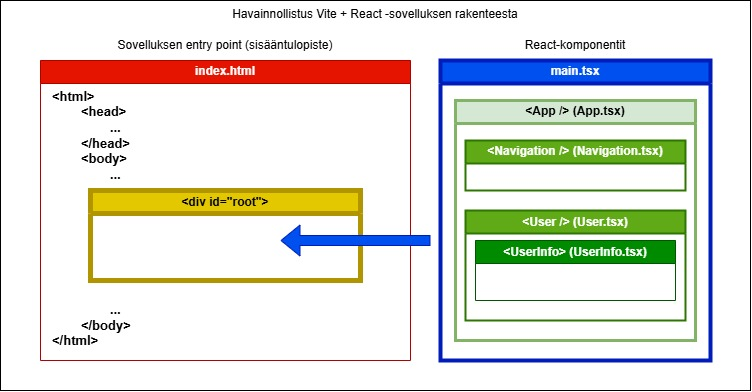

# Vite+React -sovelluksen entry point (sisääntulopiste)

### [<- Takaisin](../README.md)

[Index.html](../index.html) -tiedosto toimii React-sovelluksen sisääntulopisteenä (entry point) ja React-komponentit tulostetaan "upotettuna" tähän. Toiminnallisesti demoissa tehtävät React-sovellukset ovat pääasiassa ns. SPA-sovelluksia (Single Page Application), eli itse HTML-dokumentista ei siirrytä toiseen dokumenttiin. React-sovelluksessa renderöitävä (eli selaimeen tulostuva) sivu pysyy samana koko ajan, mutta React-komponentteja ohjelmallisesti hallitsemalla muutetaan sivuston näkymää.

React-sovelluksen toimintaa ei tarvitse vielä ymmärtää kovin syvällisesti, mutta käytännössä joka kerta, kun jotain muuttuu React-sovelluksessa, sivulla näytettävät komponentit uudelleenrenderöidään uusilla tiedoilla. Sivu itsessään pysyy samana, mutta tulostamalla komponentit uudelleen mahdollisten näkymään vaikuttavien muutosten jälkeen, saadaan aikaan efekti, jossa sivusto muuttuu.

Index.html-sivu pitää siis ehdottomasti olla projektissa, jotta sovellus toimii, mutta tänne ei tarvitse tehdä muutoksia. Sivulla oleva `
`-elementti toimii kehyksenä React-komponenteille. [React-sovelluksen juurikomponentti](../src/main.tsx) viittaa tähän HTML-elementtiin ja luo siitä React-juuren, jonka sisällä varsinaiset funktionaaliset komponentit renderöidään. Voidaan myös puhua tulostamisesta, näyttämisestä jne.

