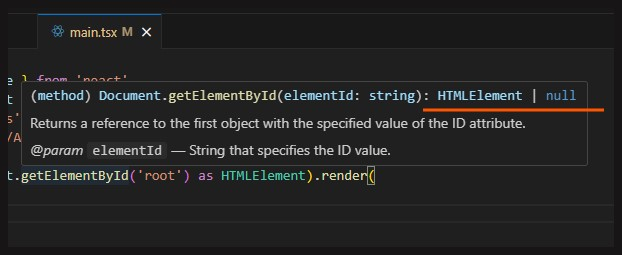

# React-sovelluksen juurikomponentti - Main

### [<- Takaisin](../README.md)

React-sovelluksissa on tavallisesti ns. [juurikomponentti](../src/main.tsx), joka tekee viittauksen [sisääntulopisteen](../index.html) "root"-HTML -elementtiin ja luo tästä React-juuren. "Mainia" ei tarvitse juurikaan muokata React-sovelluksia tehdessä. Ainoat merkittävät muutokset demoissa tehdään pääasiassa muotoiluihin ja tyyleihin liittyen. "Main" tuo koko React-sovelluksen kattavat tyylit [omassa css-tiedostossaan](../src/index.css), jotka vaikuttavat Reactin kaikilla komponenttien tasoilla. Jos halutaan tehdä näihin yleisiin tyyleihin muutoksia, niin silloin muokataan päätyylejä tai määritetään uusia tuonteja tähän "Mainiin".

Käydään tässä alla vielä nopeasti koodit rivi riviltä.

## 1. Moduulien tuonnit

```ts
import { StrictMode } from 'react'
import { createRoot } from 'react-dom/client'
import './index.css'
import App from './App.tsx'
```

Kaikki ohjelmatiedoston tarvitsemat tyylit pitää tuoda (import) erillisinä moduuleina. Moduulit ovat siis muualla React-sovelluksen hakemistossa olevia kansioita ja tiedostoja, joissa on määritelty erilaisia toiminnallisuuksia.

Esimerkiksi tässä tuodaan React-sovellusten "core"-ominaisuuksista `StrictMode`-komponentti ja selainpohjaisten React-verkkosovellusten juuren muodostamiseen tarvittava `createRoot`-metodi `react-dom/client`-moduulista.

Muita tuonteja ovat React-sovelluksen päätason tyylit ja varsinainen sovelluksen näkymän määrittävä [App-komponentti](../src/App.tsx), joka onkin demoissa ja oppimistehtävissä se tiedosto, johon suurin osa ohjelmoinnista tehdään.

Komponentteja voidaan siis tuoda moduuleina osaksi toisia komponentteja. [Main.tsx](../src/main.tsx) huolehtii Reactin juuren määrittämisestä ja kokoaa kaikki renderöitävät komponentit allensa, jolloin se tuo myös App-komponentin käyttönsä. App-komponentin puolella ei tehdä mitään määrityksiä liittyen siihen, missä päin sovellusta se renderöidään. Se vain on, ja odottaa kutsua muualta päästäkseen käyntiin. 

## 2. React-juuren luonti

```tsx
createRoot(document.getElementById('root')!).render(
  <StrictMode>
    <App />
  </StrictMode>,
);
```

React-juuri luodaan kutsumalla Reactin `react-dom/client`-moduulista importattua `createRoot`-metodia. Tämä juuren luonti liittyy vain ja ainoastaan selaimella suoritettavien React-verkkosovellusten kehittämiseen ja vastaavaa tapaa ei käytetä esimerkiksi React Native -sovellusten kehittämisessä.

`createRoot`-metodilla siis luodaan React-sovelluksen juuri jostain parametrina syötetystä HTML-elementin id:stä. Tässä tapauksessa käytetään [sisääntulopisteen](../index.html) `<div id="root">`-elementtiä. Huomioi, että `createRoot`-metodissa viitataan HTML-dokumenttiin, josta haetaan elementtiä annetulla id:llä, joka on root.

Määrityksen perässä oleva huutomerkki `!` on TypeScriptin "Non-Null Assertion" -operaattori, joka kertoo, että viitattava elementti ei koskaan ole `null`. Jos pitää hiirtä hetken `getElementById`-metodin päällä, VS Coden aputyökalu näyttää lyhyen kuvauksen metodin säännöistä ja täällä kerrotaan, että metodin palautuksena voi tulla joko HTMLElement tai `null`-arvo, jos annetulla id:llä ei löytynyt HTML-elementtiä. Nyt tiedämme, että olemme määrittäneet sovelluksen sisääntulopisteessä div-elementin id:llä "root", joten emme koskaan saa palautuksena `null`-arvoa.



Juuren luovan metodin perään on suoraan ketjutettu `render`-metodi, joka määrittää komponenttien tulostamisen annettuun juureen. Yllä olevan koodin voisi myös muotoilla niin, että ensin luodaan React-juurelle muuttuja, jonka arvoksi määritetään ´createRoot´-muodostin samalla HTML-elementin viittauksella ja tämän jälkeen omassa komennossaan tehtäisiin renderöinti.

```tsx
const root = createRoot(document.getElementById('root') as HTMLElement);
root.render(
    <StrictMode>
        <App />
    </StrictMode>
);
```

Jälkimmäisessä tavassa hyvää on se, että nyt juuri on luotu explisiittisesti välimuuttujan (vakion) avulla ja sen tyyppikin on määritelty tarkemmin `as HTMLElement` -tyyppimuunnoksella. Vite luo kuitenkin oletuksena juuren ylemmällä tavalla, joten tätä ei ole tarpeellista käydä erikseen muokkaamaan joka kerta.

### 2.1 StrictMode-komponentti

Reactin juuressa renderöitävät komponentit ympäröidään [`StrictMode`-komponentilla](https://react.dev/reference/react/StrictMode "https://react.dev/reference/react/StrictMode"), jota käytetään virheiden etsimiseen kehitystyön aikana. Tämä on hyvä olla aina mukana React-sovelluksia kehittäessä. Tarkemmat tiedot linkin takaa Reactin dokumentaatiosta.

### 2.2 App-komponentin renderöinti

App-komponentti otetaan käyttöön sovelluksessa renderöimällä se React-juuressa. Renderöinti tapahtuu kutsumalla komponenttia sen omalla HTML-merkkausta muistuttavalla tagilla. Koska komponentti renderöidään sellaisenaan, eikä sen sisälle tuoda mitään muita komponentteja, \<App /> merkitään "sinkkutagilla", jonka sulkevassa osassa on `/`.