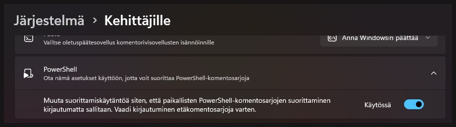

# Vite-kehityspalvelimen konfigurointi

### [<- Takaisin](../README.md)

Tässä dokumentissa ohjeistetaan Vite+React -projektin luominen aivan alusta ja kehityspalvelimen portin konfiguroiminen oppimistehtäviä ja demoja varten.

## 1. Kehitysympäristön asennus

Vite-kehitysympäristö ja TypeScript-pohjainen React-projekti asennetaan seuraavasti

1. Luodaan tietokoneella uusi tyhjä kansio johonkin hakemistoon. Tähän kansioon luodaan Vite+React -projekti.
2. Avataan kansio Visual Studio Code -tekstieditorilla
3. Avataan komentokehote (Terminal)
4. Asennetaan Vite-kehitysympäristö komennolla
    - `npm create vite@latest . -- --template react-ts`
5. Seurataan asennusohjelman ohjeita
    - Framework: React
    - Variant: TypeScript/TypeScript+SWC
6. Asennetaan Vite-kehitysympäristön Node-riippuvuudet komennolla
    - `npm install`
7. Käynnistetään kehityspalvelin komennolla
    - `npm run dev`

### Huom! Jos et voi suorittaa npm-komentoja johtuen PowerShellin ExecutionPolicysta:

Windows-alustoilla on tänä päivänä oletuksena estetty tietoturvasyistä muiden, kuin Microsoftin allekirjoittamien PowerShell-skriptien suorittaminen paikallisesti. Tämä estää Noden normaalin toiminnan. Asetus voidaan muuttaa komentorivillä tai Windowsin asetuksista ja tämä on täysin turvallinen prosessi. Asetus muutetaan muotoon, jossa paikallisesti voidaan suorittaa myös muita skriptejä, jotka on ladattu internetistä, kunhan ne ovat luotettavan toimijan allekirjoittamia.

Asetus löytyy Windowsin järjestelmäasetusten "Kehittäjille"/"For developers" -osiosta. Täällä on asetus PowerShellille ja komentosarjojen suorittaminen paikallisesti kirjautumatta.



## 2. Vite-kehityspalvelimen portin konfigurointi

Porttia käytetään määrittämään hostin, eli isäntätietokoneen suorittaman sovelluksen tai palvelun tarkka reitti, johon voidaan ottaa yhteyttä verkon yli. Tietokoneella on tyypillisesti käynnissä erilaisia prosesseja taustalla ja osa näistä saattaa olla yhteydessä internettiin. Koska tietokoneen osoite on vain yksittäinen IP-osoite, ei riitä, että otetaan yhteyttä tietokoneeseen itseensä, vaan pitää myös määrittää portin avulla se, mihin tietokoneella käynnissä olevaan sovellukseen tai prosessiin halutaan ottaa yhteys. Tämä on karkea kuvaus tietokoneiden välisestä kommunikaatiosta, eikä ota huomioon teknisiä yksityiskohtia. Pointtina kuitenkin on se, että portin avulla kerrotaan tarkemmin, miten voidaan ottaa yhteys johonkin tiettyyn sovellukseen tai prosessiin tietokoneella.

Myös Vite-kehityspalvelin on prosessi, jolla on oma portti, jonka kautta kehitettävään React-sovellukseen otetaan yhteys. Kehityspalvelin ei ole näkyvissä ulkoisesti, vaan "localhostina", eli vain suorittavalle tietokoneelle itsessään. Teknisesti kuitenkin kyseessä on prosessi, joka kuuntelee tiettyyn määritettyyn porttiin tulevaa viestiliikennettä. Kun React-sovellusta testataan kehitystyön aikana, Vite luo kehityspalvelimen, jolla sovellus pyörii. Sovellukseen siis otetaan yhteyttä aivan samalla tavalla, kuin oikeassa tilanteessa, jossa sitä ylläpidettäisiin palvelimella.

Kehityspalvelimen portin voi määrittää [Viten konfiguraatiotiedostossa](../vite.config.ts) lisäämällä asetuksiin määrityksen:

```ts
export default defineConfig({
  plugins: [react()],
  server: {
    port: 3000,
  }
})
```

Portin voi vapaasti määrittää itse miksi tahansa. Tyypillisesti 3000:sta ylöspäin olevat portit ovat vapaita käyttää, eikä konflikteja pitäisi tulla.