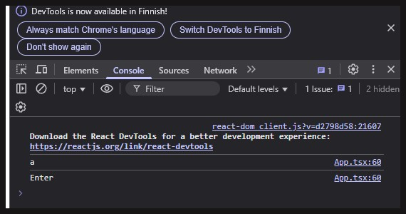

# React-sovelluksen oletusnäkymä - App-komponentti - Tehtävälista

### [<- Takaisin](../README.md)

## 1. Moduulien importaus

```ts
import React, { useState, useRef, MutableRefObject } from 'react';
import './App.css';
```

Tuodaan Reactista tarvittavat moduulit komponentin käyttöön. Tässä tehtävässä tarvitaan tilamuuttujien lisäksi uutta React Hookia `useRef`, jonka avulla elementit voivat viitata toisiinsa.

Edellisessä demossa käyttäjä kirjoitti nimensä syöttökenttään, joka päivitti `nimi`-tilamuuttujaa ja painikkeen painaminen vain muodosti suoritti metodin, joka muodosti `tervehdys`-tilamuuttujan arvon "kovakoodatusta" viestistä ja `nimi`-tilamuuttujasta.

Tässä demossa kutsutaan tehtävän lisäämisen metodia kahdesta eri elementistä (`<input />` ja `<button>`). Tehtävän luova metodi ottaa vastaan metodin kutsun yhteydessä tehtävän nimen, jolla tehtävä luodaan. Input-kentän kanssa tämä ei ole ongelma, koska tieto syötetään suoraan kentän arvosta. Button-elementin kanssa tulee kuitenkin ongelma, koska eihän buttonilla ole mitään arvoa, jonka käyttäjä olisi sille syöttänyt. Button-elementti pitää siis saada viittaamaan input-kenttään, jotta tehtävän lisäys onnistuu. Tähän kyllä palataan myöhemmin, mutta tässä lyhyesti idea.

`MutableRefObject` liittyy viittauksen tyypitykseen, eikä siitä kannata välittää tässä erityisemmin, kunhan muistaa jatkossa tarvittaessa ottaa tämän käyttöön.

## 2. Tehtävän tietorakenteen muodostaminen TypeScriptin interfacella

Uutena asiana demossa opetellaan monimuotoisempien tietorakenteiden, kuten rajapintojen (interface) käyttöä. Interface on tietorakenne, jolla voidaan muodostaa oma tyyppi TypeScriptissä, joka kuvaa jotain tietoa. Esimerkiksi string-tyyppi kuvaa merkkijonon tyyppistä tietoa ja number numeerista tietoa. Tämä onnistuu TypeScriptissä olevilla tietotyypeillä, koska nämä ovat ns. standardeja kaikissa ohjelmointikielissä.

Ei kuitenkaan ole olemassa mitään `Tehtava`-tietotyyppiä, vaikka tällaista tietoa voitaisiin haluta kuvata ja käyttää sovelluksessa. TypeScriptin interfacet mahdollistavat nyt omien tietotyyppien muodostamisen, jolloin ohjelma tietää, että tämäntyyppistä muuttujaa tai vakiota määrittäessä, sen tulisi sisältää interfacessa määritettyjä tietoja.

Tehtävälista-sovelluksessa määritetään tehtävää kuvaava tietotyyppi, joka sisältää tehtävän nimen ja tiedon, onko se tehty:

```ts
interface Tehtava {
  nimi : string,
  tehty : boolean
}
```

Interfacella voidaan määrittää tilanteesta riippuen paljon erilaisia tietoja. Se voi sisältää myös numeroita, yhden tai useamman arrayn, olioita jne. Nyt kun `Tehtava` interface on määritetty, voidaan sitä käyttää muuttujien TypeScript-tyyppinä, joka kertoo ohjelmalle, että Tehtävän tulisi sisältää nämä määritetyt tiedot.

Kaikkien tietojen ei tarvitse olla pakollisia, jos se on sovelluksen toiminnan kannalta haluttua. Interfacessa jokin avain vodaan merkitä [vaihtoehtoiseksi](https://www.typescriptlang.org/docs/handbook/2/objects.html#optional-properties "https://www.typescriptlang.org/docs/handbook/2/objects.html#optional-properties") kysymysmerkillä `?`, jolloin tätä arvoa ei ole pakollista määrittää. Tämä pitää tosin huomioida muualla ohjelmassa, ettei väkisin yritä poimia oliosta tyhjää arvoa.

```ts
interface Tehtava {
    nimi: string,
    poimittu?: boolean
}
```

Tätä ei kuitenkaan havainnollisteta käytännössä osana demoa.

## 3. useRef-hookin määritys ja käyttö

`useRef`-hookin avulla voidaan määrittää viittaus johonkin HTML-elementtiin React-komponentissa. Tämä on hyödyllistä silloin, kun jossain elementissä halutaan viitata toisen elementin tietoihin.

```ts
const uusiTehtava : MutableRefObject<any> = useRef<HTMLInputElement>();
```

Tässä määritetään viittaus `uusiTehtava`, joka asetetaan alempana koodissa input-kentän viittaukseksi. Jos jossain toisessa elementissä viitataan nyt tähän `uusiTehtava`-vakioon, päästään käsiksi siihen tietoon, mihin viittaus osoittaa.

`MutableRefObject` on viitattavan elementin arvon tyyppi ja tässä se kannattaa määrittää `any`:ksi. Tätä ei sen tarkemmin käydä demoissa läpi, mutta kun tehdään viittaus HTML-elementtiin `useRef<HTMLInputElement>()`, varsinainen viittauksen olio voi vaihdella elementistä riippuen.

`useRef<HTMLElement>()`-määrityksessä kerrotaan, millainen elementti on kyseessä. Demon tapauksessa viitataan input-kenttään, jolloin merkintä on `useRef<HTMLInputElement>()`.

## 4. Tehtävä-olioita tallentava array tilamuuttujana

Demossa on rakennettu tehtävien tallentamiselle oma tilamuuttuja, joka kerää kaikki luodut `Tehtava`-oliot yhteen arrayhin.

```ts
const [tehtavat, setTehtavat] = useState<Tehtava[]>([
                                          {
                                            nimi : "Käy kaupassa", 
                                            tehty : false
                                          },
                                          {
                                            nimi : "Siivoa", 
                                            tehty : true
                                          },
                                          {
                                            nimi : "Ulkoiluta koiraa", 
                                            tehty : false
                                          }
                                        ]);
```

Tilamuuttujan merkintä tapahtuu aivan samalla tavalla kuin yksittäisen merkkijonon kanssa, mutta koska tässä käsitellään arrayta `Tehtava`-olioista, pitää tyypitys muistaa tehdä oikein: `useState<Tehtava[]>`. Samalla on alustettu kolme tehtävää, joilla on nimi ja tehty-tieto.

Olion merkintä tapahtuu samalla tavalla aaltosulkeilla ja avain-arvo -parit eroteltuna pilkuilla omille riveilleen, kuten interfacen määrittelyssä.

## 5. Uuden tehtävän lisäys

Uuden tehtävän lisääminen `tehtavat`-arrayhin vaatii hieman suunnitelmallisuutta, koska nyt ei voida vain "setata" yksittäistä tehtävää listaan, sillä se pyyhkisi kaikki aiemmat tehtävät (ja tyyppikin on eri).

```ts
const lisaaTehtava = (tehtavanNimi : string) : void => {

    let uusiTehtava : Tehtava = {
      nimi : tehtavanNimi,
      tehty : false
    }

    setTehtavat([...tehtavat, uusiTehtava]);
  }
```

Luodaan metodi `lisaaTehtava`, joka ottaa vastaan parametrina tehtävän nimen, joka on tyypiltään string. Metodi ei palauta tietoa, eli tyyppi on void.

Käytetään apumuuttujaa uuden tehtävän luomiseen. Voidaan määrittää muuttuja `uusiTehtava`, joka on tyyppiä ylempänä itse määrittämämme interface `Tehtava`. Tälle voidaan asettaa arvoja tavalliseen tyyliin, mutta nyt arvo asetetaan jokaiselle parametrille, jota tehtävässä on. Tehtävän nimi saadaan parametrina metodin kutsusta ja tehty-tieto asetetaan oletuksena `false`:ksi. Eihän tehtävää todennäköisesti ole tehty vielä silloin, kun se lisätään listaan.

Tämän jälkeen `tehtavat` tilamuuttujan uusi arvo asetetaan. Koska toimitaan arrayn kanssa, pitää edelliset tehtävät ja uusi tehtävä yhdistää uudessa arrayssa, joka asetetaan `tehtavat` muuttujan uudeksi arvoksi.

1. Kutsutaan metodia `setTehtavat` ja aletaan muodostamaan uutta arrayta hakasulkeilla `[...]`
2. Vanhat tehtävät voidaan "avata" hyödyntäen spread-operaattoria `...`, joka purkaa `tehtavat`-arrayn jo olemassa olevat tehtävät takaisin yksittäisiksi `Tehtava`-olioiksi.
3. Tämän jälkeen `uusiTehtava` lisätään arrayn viimeisimmäksi alkioksi

Teknisesti tämä spreadaus aiheuttaa tällaisen efektin:

```ts
setTehtavat([
    {
        nimi : "Käy kaupassa",
        tehty : false
    },
    {
        nimi : "Siivoa",
        tehty : true
    },
    {
        nimi : "Ulkoiluta koiraa",
        tehty : false
    },
    uusiTehtava // Joka on myös samanmuotoinen tehtävä, joka apumuuttujassa määritettiin
])
```

Eli toden totta, muodostettiin uusi array setterin parametrina, johon avattiin vanhat tehtävät ja uutena lisäyksenä `uusiTehtava`.

Kun `lisaaTehtava("Uusi tehtava");`-metodia kutsutaan, luodaan uusi `Tehtava`-olio apumuuttujan avulla. Tämä tehtävä sitten asetetaan vanhan tehtävälistan kanssa uudeksi tehtävälistan arrayksi.

## 6. Tehtävän merkitseminen tehdyksi

Tehtävät voidaan myös merkitä tehdyiksi tai takaisin tekemättömiksi. Pitää siis jotenkin päästä johonkin tehtävälistan tehtävistä käsiksi ja vaihtaa `tehty`-arvo päinvastaiseksi.

```ts
const merkitseTehdyksi = (indeksi : number) : void => {

    let tehtavatApu : Tehtava[] = [...tehtavat];
    tehtavatApu[indeksi].tehty = !tehtavatApu[indeksi].tehty;

    setTehtavat(tehtavatApu);
  }
```

- `const merkitseTehdyksi = (indeksi : number) : void => {...}`: Metodi ottaa parametrina numeron, joka vastaa `tehtavat`-arrayn jotakin indeksiä. Arrayssa jokaisella alkiolla on indeksi, eli järjestysluku, joka kertoo, monesko alkio on listassa.

- `let tehtavatApu : Tehtava[] = [...tehtavat];`: Muodostetaan apumuuttuja `tehtavatApu`, joka on `Tehtava`-olioiden array. Tämän arvoksi "spreadataan" olemassa olevat tehtävälistan tehtävät.
    - ***Miksi tässä pitää sitten muodostaa uusi array, jos se on muodoltaan sama, kuin alkuperäinen `tehtavat`-tilamuuttuja?***
    - Tämä johtuu siitä, että tilamuuttujia ei voida suoraan muokata, vaan niille voidaan vain asettaa uusi arvo. Tehtävälista pitää siis purkaa apumuuttujan avulla ensiksi käsiteltävään muotoon, jolle muutokset tehdään ja tämä muokattu tehtävälista päivitetään vanhan tilalle.

- `merkitseTehdyksi` sai parametrina jonkin indeksin. Tällä indeksillä voidaan viitata tehtävälistan johonkin tehtävään, jonka jälkeen poimitaan sen `tehty`-arvo. Tämä voidaan nyt kääntää päinvastaiseksi not-operaattorin avulla. Tämä on hyvin yleinen tapa kääntää booleanin arvo ja tätä kutsutaan myös Toggle:ksi.
    - `tehtavatApu[indeksi].tehty = !tehtavatApu[indeksi].tehty`

- `setTehtavat(tehtavatApu)`: Lopuksi uusi muokattu lista asetetaan `tehtavat`-tilamuuttujan arvoksi

## 7. Tehtävien syöttäminen uudella tavalla käyttäen input-kenttää

Demossa on toteutettu toinen tapa hyväksyä tietojen lähettäminen pelkän erillisen painikkeen lisäksi. Tässä kirjoitetun tehtävän voi lähettää painamalla Enter-näppäintä.

Tässä on nyt määritetty input-kentälle paljon muutakin, kuten viittaus `ref={uusiTehtava}`, josta puhuttiinkin ylempänä ja `onKeyDown`-tapahtumakäsittelijä.

```tsx
<input 
    ref={uusiTehtava}
    type="text" 
    placeholder="Kirjoita tehtävä ja paina enter..."
    onKeyDown={(e : any) => {
        if (e.key === "Enter") {
        lisaaTehtava(e.target.value);
        e.target.value = null;
        }
    }}
/>
```

- `ref={uusiTehtava}`: Tässä määritetään dokumentin alussa mainittu viittaus input-kentälle. Viittauksen vakio määritetään aluksi ja komponentin palautuksessa se asetetaan `ref`-ominaisuuden avulla HTML-elementin viittaukseksi. Jos jossain muussa elementissä halutaan nyt viitata input-kentän tietoihin, se tehdään kutsumalla `uusiTehtävä`-viittausta (tästä lisää painikkeessa).

- `onKeyDown={...}`: On uusi tapahtumakäsittelijä, joka otettiin käyttöön sen takia, että halutaan tehdä tarkistus sille, milloin käyttäjä on painanut Enter-näppäintä. `onChange`-tapahtumalla päästään kyllä käsiksi input-kentän tietoon, mutta sillä ei samalla tavalla voida poimia tietoa siitä, mitä näppäintä tapahtumassa painettiin.

```tsx
onKeyDown={(e : any) => {
    if (e.key === "Enter") {
    lisaaTehtava(e.target.value);
    e.target.value = null;
    }
}}
```

1. Tapahtumakäsittelijän callback on nuolifunktio, joka saa parametrinaan tapahtuman tiedot `(e : any) => {...}`. Tapahtuman tiedot ovat sen verran monimutkaisia, että nyt on helpompi määrittää TypeScript-tyypiksi vain `any`

2. Seuraavaksi tehdään tarkistus, oliko painettu näppäin "Enter". `onKeyDown`-tapahtuma sisältää tiedon `e.key`, joka kertoo suoraan painetun näppäimen nimen.
    - Näppäinten arvon voi käydä tarkistamassa lisäämällä tapahtumaan `console.log(e.key);`-komennon ja testaamalla tätä selaimen kehittäjätyökaluilla (F12).
    - ```tsx
        onKeyDown={(e : any) => {
            console.log(e.key);
            if (e.key === "Enter") {
            lisaaTehtava(e.target.value);
            e.target.value = null;
            }
        }}
        ```
    - Painettiin "a" ja sitten "Enter"
    - 

3. Jos painettu näppäin oli "Enter", suoritetaan `lisaaTehtava`-metodin kutsu input-kentän senhetkisellä arvolla. Tämä tehdään samoin, kuin Demo 1:ssä

4. Lopuksi lisäominaisuutena onnistuneen tehtävän lisäämisen jälkeen syöttökenttä tyhjennetään asettamalla sen arvoksi `null`. Tämä on sellainen ns. quality of life -ominaisuus, jotta käyttäjän ei tarvitse joka lisäyksen jälkeen pyyhkiä kenttää itse.

## 8. Tehtävän lisääminen painikkeella viitaten syöttökenttään

Tehtävä voidaan lisätä myös painikkeella syöttökenttään. Tässä käytetään edellisestä demosta tuttua `onClick`-käsittelijää, mutta uutena asiana on nyt toisen elementin tietoihin viittaaminen `useRef`-hookilla.

```tsx
<button onClick={ (e) => { 
    lisaaTehtava(uusiTehtava.current.value) 
    uusiTehtava.current.value = null;   
}}>Lisää</button>
```

Painikkeessa kutsutaan `lisaaTehtava`-metodia, joka vaatii parametrikseen merkkijonon, eli tässä tehtävän nimen. Nappi ei suoraan voi poimia input-kentästä syötettä, vaan tieto saadaan poimittua nyt input-kentän `ref`-ominaisuutta hyödyntäen, johon `uusiTehtävä`-vakio oli asetettu. Eli syötteen teksti poimitaan `uusiTehtava.current.value`-komennolla.

Samalla viittausta hyödynnetään tekstikentän tyhjentämisessä.

## 9. Tehtävien tulostaminen ohjelmallisesti listana komponentissa

Lopuksi tehtävät tulostetaan ohjelmallisesti selaimeen listaan, jossa jokainen tehtävä on oma \<li>-elementti.

```tsx
<ul>

    {tehtavat.map( (tehtava : Tehtava, idx : number) => {

        return (
            <li key={idx} onClick={() => { merkitseTehdyksi(idx); }}>
            { (tehtava.tehty === true) 
                ? <del>{tehtava.nimi}</del> 
                : tehtava.nimi 
            }
            </li>
        );
    } )}
</ul>
```

Edellisessä demossa mainittiin, ettei JSX-merkinnässä `{...}` voida käyttää ehto- ja toistorakenteita. Ehtorakenne piti toteuttaa ternary-operaattorilla ja nyt toistorakenne tehtävien läpikäymiselle ja tulostamiselle pitää toteuttaa omalla tavallaan.

```tsx
{tehtavat.map( (tehtava : Tehtava, idx : number) => {...}
```

JavaScriptissä array voidaan "mapata", jolloin `map()`-metodin callbackina suoritetaan jokin toiminto kaikille arrayn alkioille. Tässä `tehtavat`-arrayn `Tehtava`-alkiot poimitaan yksi kerrallaan ja niille tehdään jotain. Toinen parametri on tehtävän indeksi arrayssa, jota voidaan hyödyntää uniikkien tunnisteiden asettamiseksi tulostettaviin tehtäviin. Näin niihin päästään käsiksi tehtävien tehdyksi-merkkauksessa.

```tsx
<li key={idx} onClick={() => { merkitseTehdyksi(idx); }}>
    { (tehtava.tehty === true) 
        ? <del>{tehtava.nimi}</del> 
        : tehtava.nimi 
    }
</li>
```

Tässä tehtävän listaelementti muodostetaan ja sille määritellään `onClick`-tapahtuma, joka suoritetaan, kun käyttäjä klikkaa listaelementtiä. Tämä taas vaikuttaa listaelementin tekstin tulostukseen.

1. `<li key={idx}`: Listaelementille asetetaan `key`-ominaisuus, joka toimii elementin yksilöivänä tunnisteena. Avaimena käytetään arraysta poimittavaa tehtävän indeksiä, jolloin listatut tehtävät vastaavat alkuperäisen arrayn tehtäviä oikeassa järjestyksessä.
2. `onClick={() => { merkitseTehdyksi(idx); }}>`: Klikkauksen käsittelijässä kutsutaan `merkitseTehdyksi(idx)`-metodia, jonka parametrina annetaan mappauksesta saatava indeksi. Jos palataan ylemmäksi katsomaan `merkitseTehdyksi`-metodin kuvausta, se ottaa vastaan parametrina numeromuotoisen indeksin, jolla oikea tehtävä poimitaan arraysta ja sen `tehty`-arvo asetetaan päinvastaiseksi.
    - Parametrin vastaanottavaa metodia ei voida suoraan asettaa tapahtuman callbackiksi, vaan tämä pitää toteuttaa nuolifunktion avulla.
3. ```tsx
    { (tehtava.tehty === true) 
        ? <del>{tehtava.nimi}</del> 
        : tehtava.nimi 
    }
    ```
    Seuraavaksi tarkastetaan ternary-operaattorin avulla, mikä on tehtävän tila.
    - Jos tehtävä on tehty, merkitään tehtävän nimi HTML:n \<del>-elementin avulla yliviivatuksi.
    - Jos tehtävä on tekemättä, sen nimi tulostetaan normaalisti
4. `</li>`: Lopuksi listaelementti suljetaan, eli elementin sisältämä rakenne määriteltiin \<li>-tagien välissä.

## Lopuksi

Tässä käytiin Tehtävälista-sovelluksen kautta lisää Reactin peruskäsitteitä ja tietojen hallintaa TypeScriptin avulla. Komponentin JSX-rakenteeseen määriteltiin elementeille tapahtumakäsittelijöitä, joissa tiedon käsittelyyn luotuja metodeja kutsutaan tarvittavat tehtävän tiedot parametrinaan.
