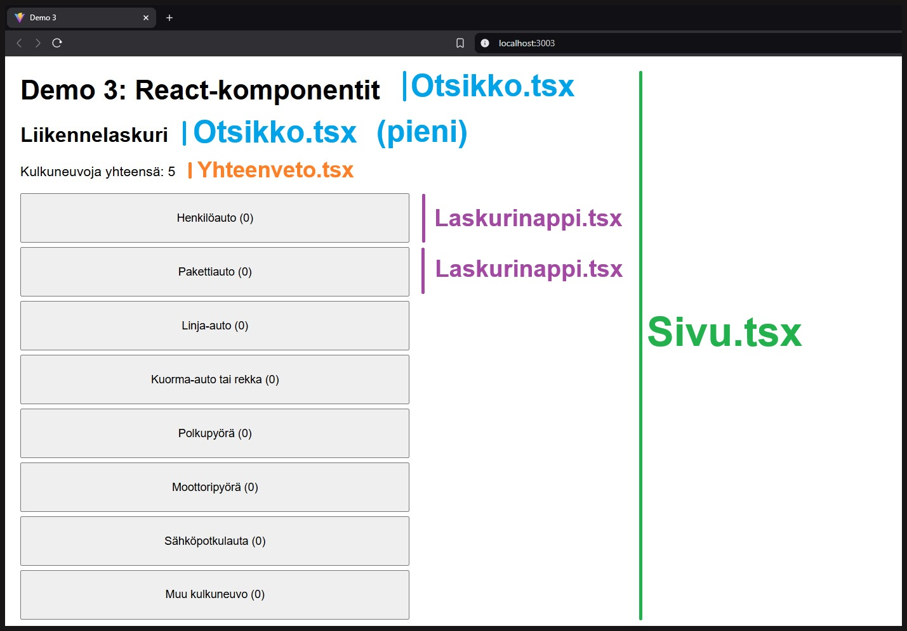

# Demo 3: React-komponentit, Liikennelaskuri

Tässä demossa on toteutettu liikennelaskuri-sovellus, joka havainnollistaa React-komponenttien toteuttamista ja käyttöä osana React-sovellusta. Demossa toteutetut komponentit ovat keskenään erilaisia ja ottavat vastaan ja palauttavat erilaista tietoa, joilla havainnollistetaan Reactin erilaisia interaktiivisuuksia komponenttien välillä.

Liikennelaskuri koostuu otsikoista, yhteenvedosta, laskuripainikkeesta ja sivun ulkoasun määrittävästä komponentista.

- Sivu-komponentti ympäröi koko Reactin App-komponentin palautusta ja sillä määritetään yleiset tyylit sovelluksen sivulle.
- Otsikko-komponentti sisältää tyylimäärittelyn ison tai pienen tason otsikolle.
- Yhteenveto-komponentti tulostaa kaikkien laskettujen kulkuneuvojen yhteismäärän.
- Laskurinappi-komponentti määrittää tilamuuttujan ja klikkauksen tapahtuman, jota hyödynnetään App-komponentissa laskemaan kulkuneuvojen yhteismäärää

 

#### Huom!

Tässä dokumentaatiossa ei käydä enää aiempien demojen aikana harjoiteltuja asioita, vaan dokumentoituna ovat pääasiassa vain uudet käsitteet ja koodit. Jos jotain koodia ei ole tässä selitetty kertauksena, mutta tarvitset muistinvirkistyksen, vertaa, miten se on toteutettu ja dokumentoitu aiemmissa demoissa.

#### Demon asentaminen

Voit asentaa demon koneellesi näillä ohjeilla:

- Kloonaa koko demo-repositorio koneellesi
- Avaa demokansio VS Codessa
- Suorita komentokehotteessa (Terminal) komento:
    - `npm install`
- Käynnistä sovellus komennolla:
    - `npm run dev`

## Sisällys

### [Sovelluksen pääkomponentti, App.tsx](./readme/APP.TSX-KOODIT.md)
### [Liikennelaskurin tyylit ja rakenne, Sivu.tsx](./readme/SIVU.TSX-KOODIT.md)
### [Sovelluksen otsikot, Otsikko.tsx](./readme/OTSIKKO.TSX-KOODIT.md)
### [Kulkuneuvojen laskuripainikkeet, Laskurinappi.tsx](./readme/LASKURINAPPI.TSX-KOODIT.md)
### [Kaikkien kulkuneuvojen yhteenveto, Yhteenveto.tsx](./readme/YHTEENVETO.TSX-KOODIT.md)