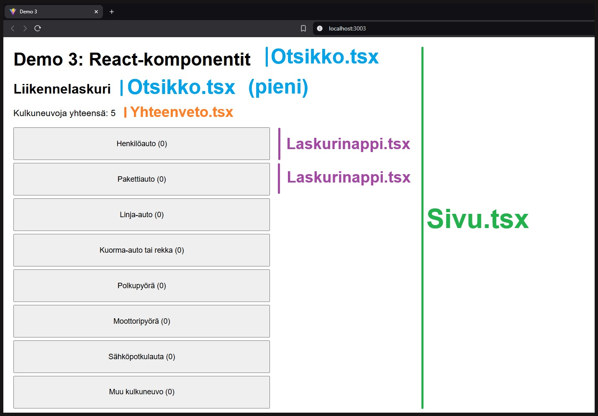

# Demo 3: Liikennelaskuri

Tässä demossa harjoittelemme React-komponenttien toteuttamista ja tuomista osaksi React-sovelluksen päätason App-komponenttia. Demossa toteutetaan useampi komponentti, jotka sisältävät erilaisia ominaisuuksia ja toiminnallisuuksia, ja näiden käyttäminen vaatii huomioimaan tiettyjä asioita.

Liikennelaskuri koostuu otsikoista, yhteenvedosta, laskuripainikkeesta ja sivun ulkoasun määrittävästä komponentista.

- Sivu-komponentti ympäröi koko Reactin App-komponentin palautusta ja sillä määritetään yleiset tyylit sovelluksen sivulle.
- Otsikko-komponentti sisältää tyylimäärittelyn ison tai pienen tason otsikolle.
- Yhteenveto-komponentti tulostaa kaikkien laskettujen kulkuneuvojen yhteismäärän.
- Laskurinappi-komponentti määrittää tilamuuttujan ja klikkauksen tapahtuman, jota hyödynnetään App-komponentissa laskemaan kulkuneuvojen yhteismäärää

<br>



---

<br>
<br>
<br>

# Komponenttien selitykset

## App.tsx

Aloitetaan App-komponentista, joka toimii sovelluksen päätasona. App-komponentti rakentaa liikennelaskurin muilla komponenteilla, jolla voidaan laskea eri kulkuneuvojen määriä.

<br>

#### Ensimmäiseksi tuonnit (imports):
```typescript
import { useState } from 'react';
```

Tuodaan Reactin useState-hook, jolla luodaan tilamuuttuja kulkuneuvojen yhteismäärän laskemiselle.

<br>

#### Seuraavaksi määritellään kulkuneuvot-taulukko:
```typescript
const kulkuneuvot : string[] = ["Henkilöauto", "Pakettiauto", ...]
```

Tämä on lista kaikista kulkuneuvotyypeistä, joita voidaan laskea. TypeScript-merkintä `: string[]` kertoo, että taulukko sisältää vain merkkijonoja.

<br>

#### Tilamuuttuja kulkuneuvojen yhteismäärälle:
```typescript
const [yhteensa, setYhteensa] = useState<number>(0);
```

<br>

#### `lisaaYksi`-funktio kasvattaa `yhteensä`-muuttujaa yhdellä:
```typescript
const lisaaYksi = () : void => {
    setYhteensa(yhteensa + 1);
}
```

<br>

#### Komponentin palautuksessa (return) rakennetaan käyttöliittymä:
```typescript
return (
    <Sivu>
        <Otsikko>Demo 3: React-komponentit</Otsikko>
        ...
```
Tässä käytetään useita mukautettuja komponentteja: `Sivu`, `Otsikko`, `Yhteenveto` ja `Laskurinappi`.

<br>

#### Kulkuneuvot-array mapataan ja jokaiselle luodaan oma laskurinappi:
```typescript
{kulkuneuvot.map((kulkuneuvo : string, idx : number) => {
    return(
        <Laskurinappi paivitaSumma={lisaaYksi} key={idx}>{kulkuneuvo}</Laskurinappi>
    );
})}
```
Tämä luo jokaiselle kulkuneuvolle oman napin. Map-funktio käy läpi kulkuneuvot-taulukon ja luo jokaisesta alkiosta oman yksilöidyn (huom. `idx`) Laskurinappi-komponentin. Laskurinappi-komponenttiin on määritetty `paivitaSumma`-tapahtuma, jonka kuuntelijaksi lisätään kulkuneuvojen kokonaismäärää kasvattava `lisaaYksi`-metodi.

**Huomioi**, että App-komponentin palautuksessa Sivu on ylimmän tason tag React Fragmentin sijasta, mutta kulkuneuvojen mappaus on ympäröity Fragment-tagilla. Tämä on siksi, että Sivu-komponentti voi ottaa lapsielementeikseen vain tietyn tyyppisiä elementtejä ja ympäröimällä mappauksen funktio Fragmentilla, siitä tehdään ReactElement-tyyppi, joka on hyväksyttävä tyyppi Sivu-komponentin lapsielementiksi.

<br>

## Sivu.tsx

Sivu-komponentti toimii "kehyksenä" koko sovellukselle. Se on App-komponentin palautuksessa ylin taso, jonka sisälle kaikki muu sisältö tulostetaan. Selitetään alla Sivu-komponentin toimintaa.

#### Aloitetaan Props-rajapinnan määrittelystä:
```typescript
interface Props {
    children : React.ReactElement | React.ReactElement[] | string
}
```
Tämä rajapinta määrittelee, millaista sisältöä Sivu-komponentti voi ottaa vastaan lapsielementteinä, eli mitä Sivu-komponenttia kutsuvien `<Sivu>...</Sivu>`-tagien välissä voi olla. Pureudutaan lapsielementtien tyyppimäärittelyyn:
- `React.ReactElement` tarkoittaa yksittäistä React-elementtiä (esim. `<Otsikko>`)
- `React.ReactElement[]` tarkoittaa React-elementtien taulukkoa (esim. useampi `<Otsikko>` peräkkäin)
- `string` tarkoittaa tavallista tekstiä
- Pystyviiva `|` on "tai"-operaattori, jolla määritetään, että children voi olla mitä tahansa näistä kolmesta

<br>

#### Seuraavaksi katsotaan komponentin määrittelyä:
```typescript
const Sivu : React.FC<Props> = (props : Props) : React.ReactElement => {
```
Tässä tapahtuu monta asiaa:
- `React.FC` tarkoittaa "Function Component", eli kyseessä on funktionaalinen React-komponentti
- `<Props>` kertoo TypeScriptille, että tämä komponentti käyttää aiemmin määriteltyä Props-rajapintaa
- `(props : Props)` ottaa vastaan props-objektin, joka noudattaa Props-rajapintaa
- `: React.ReactElement` määrittelee, että funktio palauttaa React-elementin (JSX-elementti)

<br>

#### Komponentin runko sisältää return-lausekkeen:
```typescript
return (
    <div
        style={{
            maxWidth : "500px",
            margin: "10px",
            fontFamily: "'Arial', sans-serif"                
        }}
    >
        {props.children}
    </div>
); 
```
Tämä luo div-elementin, jolla on seuraavat tyyliominaisuudet:
- `maxWidth: "500px"` rajoittaa sisällön leveyden 500 pikseliin
- `margin: "10px"` luo 10 pikselin marginaalin kaikille Sivun reunoille
- `fontFamily: "'Arial', sans-serif"` asettaa fontiksi Arialin, tai jos sitä ei löydy, käytetään sans-serif-fonttia

`{props.children}` tulostaa kaiken sisällön, joka on laitettu Sivu-komponentin sisään.

<br>

#### Kun Sivu-komponenttia käytetään App-komponentissa:
```typescript
<Sivu>
    <Otsikko>Demo 3: React-komponentit</Otsikko>
    <Otsikko tyyli="pieni">Liikennelaskuri</Otsikko>
    <Yhteenveto yhteensa={yhteensa}/>
    // ... laskurinapit
</Sivu>
```
Kaikki nämä elementit menevät `props.children`-ominaisuuteen ja renderöityvät Sivun div-elementin sisään. Ne perivät Sivu-komponentin määrittelemät muotoilut.

#### Lopuksi

`export default Sivu` tekee komponentista käytettävän muissa tiedostoissa. Tämän ansiosta App-komponentti voi tuoda sen lauseella `import Sivu from './components/Sivu'`.

<br>

## Otsikko.tsx

Tarkastellaan, miten Otsikko-komponentti rakentuu ja toimii osana sovellusta.

#### Aloitetaan Props-rajapinnan määrittelystä:
```typescript
interface Props {
    children : string,
    tyyli? : string
}
```
Tässä määritellään komponentin vastaanottamat propsit eli ominaisuudet:
- `children : string` määrittelee, että komponentin sisältö (children) on oltava tekstimuotoinen
- `tyyli? : string` määrittelee valinnaisen tyyli-ominaisuuden. Kysymysmerkki (?) tekee tästä propista valinnaisen, eli sitä ei ole pakko antaa komponentille

<br>

#### Seuraavaksi komponentti määritellään:

```typescript
const Otsikko : React.FC<Props> = (props : Props) : React.ReactElement => {
```

Määrittelyssä tapahtuu seuraavat asiat:

- Määritellään komponentti nimeltä "Otsikko"
- `React.FC<Props>` kertoo, että kyseessä on React-funktiokomponentti, joka käyttää yllä määriteltyä Props-rajapintaa
- `(props : Props)` ottaa vastaan props-objektin, jonka täytyy noudattaa Props-rajapintaa
- `: React.ReactElement` määrittelee, että funktio palauttaa React-elementin

<br>

#### Komponentin runko sisältää palautuksen:
```typescript
return (
    <>
        {(props.tyyli === "pieni")
            ? <h2>{props.children}</h2>
            : <h1>{props.children}</h1>
        }
    </>
);
```
Palautuksen osat:
- `<>...</>`-tagit ovat React Fragmentin lyhenne. Fragment mahdollistaa useiden elementtien palauttamisen ilman ylimääräistä DOM-elementtiä
- Käytetään ehdollista (ternary) operaattoria `?` ja `:` valitsemaan otsikon tyyli
- Jos `props.tyyli === "pieni"` on totta, käytetään h2-elementtiä (pienempi otsikko). Muussa tapauksessa käytetään h1-elementtiä (isompi otsikko)
- `{props.children}` näyttää komponentin sisällön, eli otsikkotekstin

<br>

#### Kun Otsikko-komponenttia käytetään App-komponentissa:
```typescript
<Otsikko>Demo 3: React-komponentit</Otsikko>
<Otsikko tyyli="pieni">Liikennelaskuri</Otsikko>
```
Ensimmäinen Otsikko-komponentti ei saa tyyli-propsia, joten se renderöityy h1-elementtinä:
```html
<h1>Demo 3: React-komponentit</h1>
```

Toinen Otsikko-komponentti saa tyyli-propsiksi "pieni", joten se renderöityy h2-elementtinä:
```html
<h2>Liikennelaskuri</h2>
```

<br>

#### Lopuksi

`export default Otsikko` tekee komponentin käytettäväksi muissa tiedostoissa. App-komponentti voi tuoda sen lauseella `import Otsikko from './components/Otsikko'`.

<br>

## Yhteenveto.tsx

Käydään läpi Yhteenveto-komponentti ja miten se toimii osana sovelluksen kokonaisuutta.

<br>

#### Aloitetaan Props-rajapinnan määrittelystä:
```typescript
interface Props {
    children? : React.ReactElement | React.ReactElement[] | string
    yhteensa : number
}
```
Tässä määrittelemme kaksi props-ominaisuutta:
1. `children?` on valinnainen ominaisuus (huomaa kysymysmerkki), joka voi olla:
   - React-elementti (`React.ReactElement`)
   - React-elementtien taulukko (`React.ReactElement[]`)
   - Tavallinen teksti (`string`)

   Tämä mahdollistaa sen, että komponentin sisään voidaan laittaa monipuolisesti erilaista sisältöä, vaikka tässä toteutuksessa sitä ei käytetäkään.

2. `yhteensa` on pakollinen numeroarvo (`number`), joka edustaa laskurin nykyistä arvoa. Tämä on komponentin tärkein ominaisuus, sillä se näyttää kulkuneuvojen kokonaismäärän.

<br>

#### Seuraavaksi komponentti määritellään:
```typescript
const Yhteenveto : React.FC<Props> = (props : Props) : React.ReactElement => {
```

<br>

#### Komponentin palautus:
```typescript
return (
    <>
        <p>Kulkuneuvoja yhteensä: {props.yhteensa}</p>
    </>
);
```
`{props.yhteensa}` näyttää yhteensa-propsiin tallennetun numeerisen arvon.

<br>

#### Kun tätä komponenttia käytetään App-komponentissa:
```typescript
<Yhteenveto yhteensa={yhteensa}/>
```
App-komponentti välittää useState-hookilla ylläpidetyn yhteensa-muuttujan arvon Yhteenveto-komponentille. Tämä arvo kasvaa aina, kun käyttäjä painaa jotakin laskurinappia.

Jos esimerkiksi käyttäjä on painanut laskurinappeja kolme kertaa, komponentti renderöityy muotoon:
```html
<p>Kulkuneuvoja yhteensä: 3</p>
```

<br>

## Laskurinappi.tsx

Käydään läpi Laskurinappi-komponentti. Tämä komponentti sisältää sekä omaa tilatietoa, että kommunikoi ylemmän tason komponentin kanssa.

#### Aloitetaan tuonnilla:
```typescript
import { useState } from "react";
```
Tuodaan useState-hook, koska komponentissa käytetään omaa laskuria.

#### Props-rajapinnan määrittely:
```typescript
interface Props {
    children : string
    paivitaSumma : () => void    
}
```
Tässä määritellään kaksi tärkeää props-ominaisuutta:
1. `children : string` määrittelee, että napin tekstisisällön täytyy olla merkkijono. App-komponentissa tämä on kulkuneuvon nimi (esim. "Henkilöauto").
2. `paivitaSumma : () => void` on funktioviittaus. Tämä mahdollistaa kommunikaation ylöspäin App-komponentin kanssa. Funktion määrittely `() => void` tarkoittaa, että funktio ei ota parametreja eikä palauta mitään.

<br>

#### Komponentin määrittely noudattaa tuttua kaavaa:
```typescript
const Laskurinappi : React.FC<Props> = (props : Props) : React.ReactElement => {
```

<br>

#### Seuraavaksi tulee komponentin oma tilanhallinta:
```typescript
const [laskuri, setLaskuri] = useState<number>(0);
```
Tämä luo jokaiselle napille oman laskurin.

<br>

#### Komponentin return-osa on monipuolinen:
```typescript
return (
    <button
        style={{
                width: "460px",
                padding: "20px",
                marginBottom: "5px"
        }}
        onClick={() : void => { 
            props.paivitaSumma();
            setLaskuri(laskuri + 1); 
        }}
    >{props.children} ({laskuri})</button>
); 
```
Tässä tapahtuu useita asioita:
1. Luodaan button-elementti, jolle annetaan tyyliominaisuudet:
   - Kiinteä leveys
   - Padding, jotta painikkeen reunojen ja tekstin välillä on tilaa
   - Välit painikkeiden alareunojen alle

2. onClick-tapahtumankäsittelijä suorittaa kaksi toimintoa napin painalluksella:
   - `props.paivitaSumma()` kutsuu App-komponentin lisaaYksi-funktiota, joka päivittää kokonaissummaa. Tarkemmin sanottuna `paivitaSumma()` asetetaan painikkeen ominaisuudeksi, joka suoritetaan klikkitapahtumassa. `paivitaSumma()`-metodiin voidaan viitata App-komponentista ja sille voidaan välittää ylemmän tason metodi suoritettavaksi klikkikäsittelijässä.
   - `setLaskuri(laskuri + 1)` kasvattaa napin omaa laskuria yhdellä. Jokaisella napilla on siis oma laskuri tietyn kulkuneuvon määrille ja App-komponentissa lasketaan kaikkien kulkuneuvojen määrä yhteensä.

3. Napin sisältö muodostuu kahdesta osasta:
   - `props.children` näyttää kulkuneuvon nimen
   - `({laskuri})` näyttää juuri tämän napin painallukset suluissa

<br>

#### Kun tätä komponenttia käytetään App-komponentissa:
```typescript
{kulkuneuvot.map((kulkuneuvo : string, idx : number) => {
    return(
        <Laskurinappi paivitaSumma={lisaaYksi} key={idx}>{kulkuneuvo}</Laskurinappi>
    );
})}
```
Arrayn mappauksessa jokaiselle kulkuneuvolle luodaan oma nappi, joka:
1. Saa tekstikseen kulkuneuvon nimen
2. Pitää kirjaa omista painalluksistaan
3. Päivittää sekä omaa laskuriaan että kokonaissummaa joka painalluksella

Tämä komponentti on hyvä esimerkki React-komponentin toiminnasta ja käyttömahdollisuuksista, koska se:
1. Hallitsee omaa tilaansa (nappikohtainen laskuri)
2. Kommunikoi ylöspäin (kokonaissumman päivitys)
3. Käyttää propseja sekä dataan (children) että toiminnallisuuteen (paivitaSumma)
4. Yhdistää visuaalisen tyylin ja toiminnallisuuden selkeäksi kokonaisuudeksi
