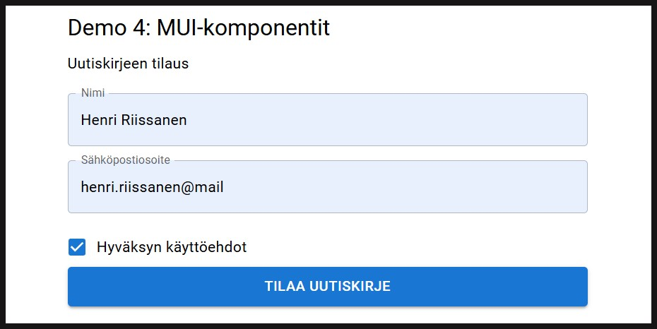

# Demo 4: MUI-komponentit

Demo 4:ssä harjoitellaan MUI-komponenttikirjaston käyttöä osana React-sovelluksen toteutusta. MUI tarjoaa tyylitellyt komponentit sovellusten toteuttamiseen. Tällainen ulkoisten tyylien käyttö suoraan sovelluksen komponenteissa onkin hyvin yleinen tapa toteuttaa moderneja ja helppokäyttöisiä sovelluksia ilman ylimääräistä työtä, joka menisi tyylien määrittelyyn itse.

MUI:sta on olemassa useampi versio ja tällä toteutuksella käytetään Googlen Material Designiin perustuvaa MUI Core/Material UI -kirjastoa. MUI:lla on myös toinen komponenttikirjasto Joy UI, joka perustuu MUI:n omaan design-periaatteeseen. Kumpikin on ihan hyvä kirjasto ja myös Joy UI:ta kannattaa halutessaan testata.

Material UI asennetaan [sivuston ohjeistuksien](https://mui.com/material-ui/getting-started/installation/ "MUI Asentaminen") mukaan komennolla:

`npm install @mui/material @emotion/react @emotion/styled`

`react` ja `react-dom` ovat MUI:n riippuvuuksia, jotka tulee olla asennettuna ennen MUI:n asentamista. Vite kuitenkin on hoitanut näiden riippuvuuksien asentamisen puolestamme Vite + React -projektin asennuksen yhteydessä.

Asennetaan myös Roboto-fontti MUI:n ohjeistuksen mukaan ja lisätään sen tuonti sovelluksen juurikomponenttiin `main.tsx`:

`npm install @fontsource/roboto`

```typescript
import '@fontsource/roboto/300.css';
import '@fontsource/roboto/400.css';
import '@fontsource/roboto/500.css';
import '@fontsource/roboto/700.css';

createRoot(document.getElementById('root')!).render(
  <StrictMode>
    <App />
  </StrictMode>,
)
```

<br><br><br>

## Demo 4: Sovelluksen rakentuminen MUI-komponenteilla (`App.tsx`)

Tässä demossa ei rakenneta isoa tai monimutkaista sovellusta, vaan havainnollistetaan suoraan App-komponentissa päätasolla MUI-komponenttien käytön perusteita. Sovelluksena luodaan Uutiskirjeen tilauslomake, jossa "tilaa"-painike aktivoituu vasta kaikkien tietojen ollessa annettu. Napin toimintona tulostetaan selaimeen alert tilauksesta.



MUI:n käytön lisäksi opiskellaan uusi React-hook, [`useEffect`](https://react.dev/reference/react/useEffect#usage), jota käytetään pääasiassa React-sovellusten linkittämiseen ulkoisiin järjestelmiin. Tässä demossa ei rakenneta ulkoista järjestelmää, vaan simuloidaan `useRef`-hookin toimintaa lomakkeen sisäisillä ehdoilla. Hookia kuitenkin käytetään sen käyttötarkoituksen mukaisesti ohjaamaan sovelluksen tilaa/toimintaa riippuen jostain seurattavasta tilamuuttujasta (tässä tapauksessa useammasta).

Todellisessa tilanteessa `useRef`-hookia [ei pitäisi koskaan](https://react.dev/learn/you-might-not-need-an-effect) käyttää Reactin sisäiseen tilan seurantaan, vaan ulkoisten järjestelmien kanssa kommunikointiin. Ulkoisella järjestelmällä voidaan tarkoittaa käytännössä mitä vain puhtaasti Reactin ulkopuolista ominaisuutta, eikä sen tarvitse olla välttämättä kokonaan erillinen sovellus. Esimerkiksi selaimen/html-dokumentin ominaisuuksien seurantaan voidaan käyttää `useEffect`iä. Uutiskirjeen tilauspainikkeen määrittelyssä on kommentoitu yhdenlainen oikeampi tapa toteuttaa lomakkeen tarkistus. [Sivulta:](https://react.dev/learn/you-might-not-need-an-effect)

> If there is no external system involved (for example, if you want to update a component’s state when some props or state change), you shouldn’t need an Effect. Removing unnecessary Effects will make your code easier to follow, faster to run, and less error-prone.

`useEffect`:ssa voidaan seurata komponentin tilan muutoksia ja reagoida niihin. Yleensä tällä ajetaan jotain ulkoisen järjestelmän kanssa kommunikointia, mutta demossa lomaketietoja seuraamalla määritetään "Tilaa uutiskirje"-painikkeen aktiivisuus.

***Eli nyt tehdään demoamisen vuoksi tarkoituksella vähän väärin React-sovelluksen ohjaus***

Sovelluksesta on poistettu kaikki tyyliviittaukset Vite:n oletusprojektiin ja kaikki tyylit tuodaan MUI:sta.

## App.tsx -komponentin toiminta

Sovelluksen päätasolla App-komponentissa on toteutettu uutiskirjeen tilaussovellus, jossa on kaksi tekstikenttää tilaajan nimelle ja sähköpostiosoitteelle ja checkbox käyttöehtojen hyväksynnälle. Uutiskirjeen voi vasta tilata, kun kaikki tiedot on annettu lomakkeelle ("Tilaa uutiskirje" muuttuu aktiiviseksi).

### Riippuvuuksien importaus

```typescript
import { Button, Checkbox, Container, TextField, Typography, FormControlLabel } from '@mui/material';
import { useState, useEffect } from 'react';
```
Koska sovelluksen tyylien toteuttamiseen käytetään MUI-kirjastoa, tuodaan kaikki halutut komponentit käyttöön `@mui/material`-riippuvuudesta.
- Uutiskirjeen tilauspainike toteutetaan MUI:n [`Button`-komponentilla](https://mui.com/material-ui/react-button/)
- Käyttöehtojen hyväksyntä toteutetaan MUI:n [`Checkbox`-komponentilla](https://mui.com/material-ui/react-checkbox/)
- Koko komponentin tilauslomake kehystetään MUI:n [`Container`-komponentilla](https://mui.com/material-ui/react-container/)
- Tietojen syöttökentät toteutetaan MUI:n [`TextField`-komponentilla](https://mui.com/material-ui/react-text-field/)
- Otsikkotekstien muotoilut määritellään MUI:n [`Typography`-komponentilla](https://mui.com/material-ui/react-typography/)

Tämän lisäksi käytetään [MUI:n System](https://mui.com/system/getting-started/usage/)-ominaisuutta oman komponenttityylin määrittämiseen. Tämä on hyödyllistä silloin, kun halutaan Material UI:sta poiketen luoda jokin yksittäinen itse tyylittelemämme komponentti, joka jatkaa Material UI:n tyylejä. Tästä lisää myöhemmin.

Reactista tuodaan tarvittavat hookit tilamuuttujien ja efektin käytölle.

<br>

### App-komponentin määrittäminen

```typescript
  const App : React.FC = () : React.ReactElement => {...}
```

Tämä on jo tuttua asiaa, eli määritellään funktionaalinen React-komponentti.

<br>

### Tilamuuttujien määrittäminen

```typescript
  const [tiedotOk, setTiedotOk] = useState<boolean>(false);
  const [nimi, setNimi] = useState<string>("");
  const [email, setEmail] = useState<string>("");
  const [ehdot, setEhdot] = useState<boolean>(false);
```

<br>

### `useEffect`-hookin määrittäminen

```typescript
useEffect( () : void => {

    if (Boolean(nimi) && Boolean(email) && ehdot) {
      setTiedotOk(true);
    } else {
      setTiedotOk(false);
    }

  }, [nimi, email, ehdot]);
```
`useEffect`-hook määritellään komponentin ylätasolla ennen palautusta ja sen käytössä tarvitaan kaksi parametria
- Funktio, joka suorittaa efektille määritellyn toiminnon (nuolifunktio)
- Riippuvuudet, eli tilamuuttujat, joiden muutoksia seurataan efektissä

Hookissa tarkastetaan if-ehtolauseella, onko lomakkeessa oleviin nimi- ja email-kenttiin annettu tekstiä ja onko käyttöehtojen checkbox aktivoitu. Tietoja seurataan tilamuuttujilla nimi, email ja ehdot, joiden arvoa muutetaan alempana vastaavissa MUI-komponenteissa.

Jos koko ehtolause on tosi, eli jokainen tieto löytyy, `tiedotOk`-tilamuuttujan arvo asetetaan todeksi. Jos jokin tiedoista puuttuu, `tiedotOk`:n tila on `false`. `tiedotOk` ohjaa uutiskirjeen tilauspainikkeen aktiivisuutta.

`useEffect`-hook suoritetaan joka kerta, kun jokin riippuvuuksiksi annetuista tilamuuttujista päivittyy. Tekstikenttien ja checkboxin kohdalla se tarkoittaa `onChange`-tapahtuman suorittamista.

<br>

### Palautuksen (return) rakenne

Käydään seuraavaksi läpi palautuksen rakenne, eli MUI-komponenttien määrittely.

#### Container-määrittää koko lomakkeen muotoilun

Container sisältää aloittavan ja lopettavan tagin `<Container maxWidth="sm">...</Container>` ja näiden väliin tulevat kaikki muut komponentit.

Container keskittää käyttöliittymän rakenteen ja sen leveyttä voidaan ohjata `maxWidth`-ominaisuudella. Tässä Containerin leveys asetetaan pieneksi (`maxWidth="sm"`).

<br>

#### Tekstien muotoilu Typography-komponentilla

```jsx
  <Typography variant="h5">Demo 4: MUI-komponentit</Typography>

  <Typography sx={{
    marginTop : "10px",
    marginBottom : "10px"
  }}>Uutiskirjeen tilaus</Typography>
```

Typography-komponenttia käytetään samoin, kuin HTML:n tekstielementtejä. Typography sisältää oletuksen ominaisuuden `variant`, jolla voidaan määrittää otsikkoelementin koko.

MUI:n system-ominaisuutta `sx` voidaan käyttää tekstin muotoiluun erityisissä tilanteissa, kun halutaan määrittää vain kerran käytettävä muotoilu. `sx`:n arvoksi annetaan olio, jossa on määritelty MUI:n mukaisesti [Typography-komponentin propsit](https://mui.com/material-ui/api/typography/), eli ominaisuudet. Typography ei itsessään sisällä marginaalin määrittämisen ominaisuuksia, mutta Typographyn kanssa voidaan suoraan käyttää [MUI Systemin ominaisuuksia](https://mui.com/system/properties/).

<br>

#### Tekstikenttien määrittäminen TextField-komponenteilla

Seuraavaksi määritellään nimen ja sähköpostiosoitteen syöttämisen tekstikentät.

```jsx
  <TextField
    sx={{
      marginTop : "10px",
      marginBottom : "5px"
    }}
    label="Nimi"
    placeholder="Etunimi Sukunimi"
    fullWidth={true}
    onChange={(e : any) => { setNimi(e.target.value) }}
  />

  <TextField
    sx={{
      marginTop : "10px",
      marginBottom : "15px"
    }}
    label="Sähköpostiosoite"
    fullWidth={true}
    onChange={(e : any) => { setEmail(e.target.value) }}
  />
```

`TextField` voidaan myös muodoilla käyttäen `sx`-ominaisuutta. Tekstikentälle annetaan label, eli otsikko ja placeholder-teksti. Otsikko näkyy tekstikentän sisällä oletuksena, mutta kun tekstikentän aktivoi kirjoittamista varten, label-teksti siirtyy kentän yläreunaan ja kentän sisällä olevaksi tekstiksi vaihtuu placeholder, jolla voidaan antaa tarkemmat ohjeet syötteen kirjoittamiselle (esim. Etunimi Sukunimi).

`fullWidth`-ominaisuudella tekstikenttä laajenee koko Container-komponentin määrittelemälle leveydelle. Jos tämän ottaa pois, tekstikenttä on pienempi. Tekstikentät asetetaan käyttöliittymään "flex"-tyylillä ja jos `fullWidth`-määrittelyä ei anna, menevät kentät vierekkäin samalle riville. Kokeile vaikka!

`onChange`-tapahtumakäsittelijä onkin jo tuttu tässä vaiheessa. Reaktiona tekstikentän muutokseen ajetaan nuolifunktio parametrinaan tapahtuman tiedot. Nuolifunktiossa kenttää vastaavan tilamuuttujan arvo päivitetään vastaamaan tekstikentän arvoa `e.target.value`.

<br>

#### Ehtojen hyväksyminen Checkbox-komponentilla

Seuraavaksi määritetään ehtojen hyväksymisen checkbox.

```jsx
<FormControlLabel
  control={<Checkbox onChange={(e : any) => { setEhdot(e.target.checked) }}/>}
  label="Hyväksyn käyttöehdot"
/>
```

Checkboxille voidaan antaa otsikko FormControlLabel-komponentilla. Näiden yhdistäminen tapahtuu niin, että FormControlLabel-komponentille määritellään sekä ohjaus (control), että otsikko. `control` arvoksi asetetaan itse Checkbox, joka sisältää vasta tapahtumamuuttujan `onChange`. Tässä checkboxin arvo saadaan `e.target.checked`-arvosta, joka on `true` tai `false`.

<br>

#### Tilauspainikkeen määrittely Button-komponentilla

Lopuksi uutiskirjeen tilauslomake viimeistellään "Tilaa uutiskirje"-painikkeella.

```jsx
<Button
  variant="contained"
  fullWidth={true}
  size="large"
  disabled={!tiedotOk}
  //disabled={(Boolean(nimi) && Boolean(email) && ehdot) ? false : true }
  onClick={ (e: any) => { alert("Olet tilannut uutiskirjeemme, kiitos!") } }
>Tilaa uutiskirje</Button>
```
[`Button`-komponentti](https://mui.com/material-ui/react-button/) sisältää paljon erilaisia ominaisuuksia, joista voi lukea lisää linkin takaa. Tässä määritellään painikkeen tyyli täytetyksi ja koko isoksi. `disabled`-ominaisuutta hyödynnetään nyt tilauspainikkeen aktiivisuuden hallinnassa. Painiketta ei voi painaa, jos `disabled`-ominaisuuden arvo on `true`. Pelkästään määrittelemällä `disabled` ilman arvon asettamista, se on oletuksena `true`, mutta arvoa voidaan myös ohjata itse määritellyllä ehdolla `disabled={ehto}`.

Tässä nyt hyödynnetään Reactin `useEffect`-hookia ja `tiedotOk`-tilamuuttujaa. Tilamuuttujan tyyppi on boolean, eli sillä on totuusarvo `true` tai `false`. `useEffect`-hook seuraa lomakkeen tekstikenttien ja checkboxin arvojen muutoksia ja tarkistaa, onko jokaiseen syötteeseen annettu hyväksyttävä tieto. Tekstikentissä pitää olla tekstiä ja checkbox pitää olla klikattu aktiiviseksi. Jos nämä kolme ehtoa täyttyvät, `tiedotOk`-asetetaan `true`:ksi. `disabled` arvo on asetettu päinvastaiseksi `tiedotOk`-arvosta (huomaa huutomerkki `!`), eli jos tiedot ovat ok, `disabled` on false ja toisinpäin. Näin hallitaan tilauspainikkeen näkyvyys.

Lopuksi tilauspainikkeelle määritellään `onClick`-tapahtumakäsittelijä, joka reaktiona suorittaa selaimen `alert`-metodin viestillä.

<br>

## Lopuksi

Tässä käytiin demo 4 lomakesovelluksen rakenne ja MUI-komponenttien käyttö. Material UI -kirjasto otetaan käyttöön asentamalle se Vite + React -projektin riippuvuudeksi ja tuomalla tarvittavat MUI-komponentit React-komponentin käytettäväksi.

MUI-komponenteilla on erilaisia ominaisuuksia ja määrittelyjä, joilla niiden muotoilua ja tyylejä voidaan ohjata perustuen ennalta määrättyihin tyyleihin. Tyylejä voi myös itse kustomoida haluamallaan tavalla. MUI-komponenttien käytöstä ja mahdollisuuksista kannattaa lukea ja opiskella lisää [dokumentaatiosta](https://mui.com/material-ui/getting-started/). Oppimistehtävissä tarvitaan oma-alotteista komponenttien käyttöä.